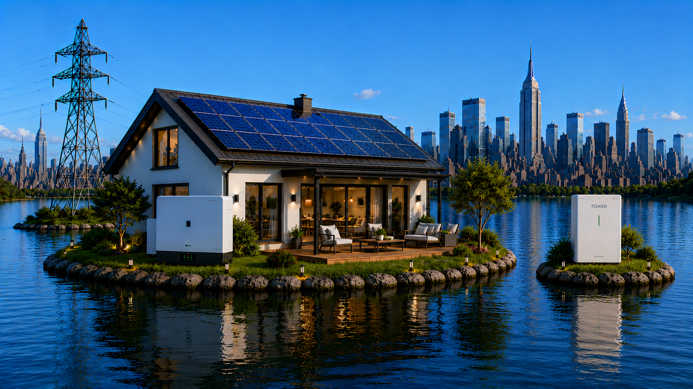

# ☀️ HASolarDev — Animated Solar Card for Home Assistant

A beautiful, fully animated solar dashboard card built with `custom:button-card`.  
Displays real-time solar production, battery status, grid info and house load —  
with a dynamic background and sun/moon that change based on the time of day.

---

## ✨ Features

- 🌅 Dynamic background — 10 stages from before sunrise to late night
- ☀️ Animated sun arc across the sky
- 🌙 Realistic moon during night stages
- ⚡ Animated energy flow beams (solar → inverter → battery → load)
- 🔋 Live battery bar with color indicator (green / yellow / red)
- 📊 Grid voltage, import/export, inverter & battery temperature
- 🎨 Sun color theme changes per time of day

---

## 📋 Requirements

- [custom:button-card](https://github.com/custom-cards/button-card) (via HACS)
- Deye inverter integrated via [Solarman](https://github.com/StephanJoubert/home_assistant_solarman) or similar
- `sun.sun` entity enabled in Home Assistant

---

## 🚀 Installation

1. Install `button-card` via HACS
2. Copy all images from the `images/` folder to `/config/www/` in Home Assistant
3. Add a new manual card in your dashboard and paste the contents of `HA_Solar_Dev.yaml`
4. Adjust sensor names to match your setup

---

## ☕ Support

If you enjoy this card, consider buying me a coffee!

---

## 📄 License

MIT License — free to use and modify.
