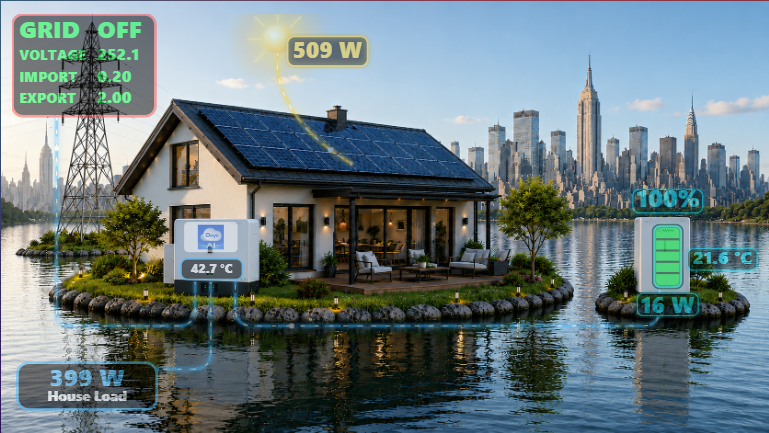

# ☀️ HASolarDev — Animated Solar Dashboard Energy Flow for Home Assistant

A modern animated solar dashboard designed for Home Assistant 

Transform your energy data into a beautiful real-time visualization featuring solar production, battery status, grid import/export tracking and dynamic day/night effects.

---

## ⭐ Support the Project

This project is developed and maintained entirely in my free time and shared with the Home Assistant community for free.

If you enjoy using this dashboard, please consider:

⭐ Starring this repository

☕ Supporting development on Ko-fi

Your support helps fund:

- New features
- Bug fixes
- Home Assistant compatibility updates
- Visual improvements and animations
- Documentation and community support

### Buy me a coffee

Every coffee helps keep the project alive and improving.

---

## 📸 Preview

---

## ✨ Features

- Real-time solar production monitoring
- Battery charge and discharge visualization
- Grid import/export tracking
- Dynamic animated energy flow
- Automatic day/night scene switching
- Animated sun that follows the daily solar cycle
- Realistic lighting effects throughout the day
- Battery color changes based on charge level
- Live battery power display
- Grid voltage monitoring
- Battery temperature monitoring
- Responsive design for desktop and mobile devices

---

## 🎯 Why this project exists

Most solar dashboards focus on displaying numbers.

HASolarDev focuses on helping users understand energy flow at a glance through animations, visual indicators and dynamic effects.

The goal is to create a dashboard that is both informative and enjoyable to use every day.

---

## 📋 Requirements

- Home Assistant
- Deye inverter integration
- custom:button-card
- card-mod
- Browser Mod (optional but recommended)

---

## 🚀 Installation

1. Install `custom:button-card`
2. Download the files from this repository
3. Copy the images to your `/config/www/` folder
4. Add the dashboard card to Home Assistant
5. Configure the required entity IDs
6. Reload Home Assistant

---

## 🔄 Ongoing Development

This dashboard is actively being improved.

Planned improvements include:

- Additional animations
- More inverter compatibility
- Improved mobile layouts
- Better customization options
- New visual themes

Suggestions and pull requests are always welcome.

---

## ❤️ Community

If you are using this project:

- Leave a ⭐ Star
- Share screenshots of your setup
- Report bugs
- Suggest improvements
- Support development through Ko-fi

---

## 📄 License

MIT License

Feel free to use, modify and improve the project.
